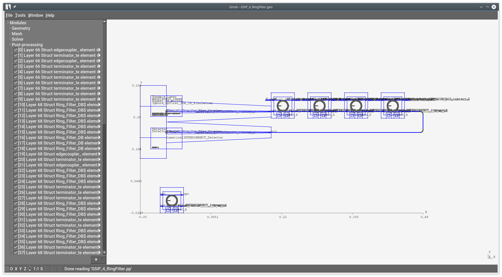

libGDSII is a C++ library for working with GDSII binary data files, intended primarily for use with the computational electromagnetism codes
[scuff-em](http://homerreid.github.io/scuff-em-documentation)
and
[meep](http://meep.readthedocs.org)
but sufficiently general-purpose to allow other uses as well.

The packages consists of

+ a C++ library (`libGDSII`)  with API functions for reading, processing, and exporting GDSII files

+ a command-line executable code (`GDSIIConvert`) for reporting statistics on GDSII geometries and
  exporting them to other file formats, notably including the [GMSH](http://gmsh.info) geometry format.

[TOC]

--------------------------------------------------
# Installation
--------------------------------------------------

```bash
% git clone http://github.com/HomerReid/libGDSII
% cd libGDSII
% sh autogen.sh --prefix=/path/to/installation/prefix
% make install
```

This will install the `GDSIIConvert` executable in `$(prefix)/bin`
and the `libGDSII.a` and/or `libGDSII.so` library binaries in `$(prefix)/lib`.

--------------------------------------------------
# Sample usage of `GDSIIConvert` command-line tool
--------------------------------------------------

The GDSII file referenced in the following examples is 
[this silicon-photonics transceiver](https://github.com/lukasc-ubc/SiEPIC-Tools/blob/master/Examples/GSiP/RingModTransceiver/Layouts/GSiP_4_RingFilter.gds)
from the [SiEPIC-Tools](https://github.com/lukasc-ubc) project:

+ Lukas Chrostowski, Zeqin Lu, Jonas Flueckiger, Xu Wang, Jackson Klein, 
  Amy Liu, Jaspreet Jhoja, James Pond, 
  ["Design and simulation of silicon photonic schematics and layouts,"](http://edx.org/course/silicon-photonics-design-fabrication-ubcx-phot1x)
  Proc. SPIE 9891, Silicon Photonics and Photonic Integrated Circuits V, 989114 (May 13, 2016); doi:10.1117/12.2230376.

## Convert to [GMSH](http://gmsh.info) format

```bash
% GDSIIConvert --GMSH GSiP_4_RingFilter.gds

Read 2080 data records from file GSiP_4_RingFilter.gds.
Wrote 91 text strings to GSiP_4_RingFilter.pp.
Detecting metallization structures on layer   1: ... 34 polygons on layer 1
Detecting metallization structures on layer   3: ... 30 polygons on layer 3
Detecting metallization structures on layer   7: ... 2 polygons on layer 7
Detecting metallization structures on layer  10: ... 78 polygons on layer 10
Detecting metallization structures on layer  20: ... 1 polygons on layer 20
Detecting metallization structures on layer  21: ... 1 polygons on layer 21
Detecting metallization structures on layer  44: ... 12 polygons on layer 44
Detecting metallization structures on layer  47: ... 30 polygons on layer 47
Detecting metallization structures on layer  60: ... 2 polygons on layer 60
Detecting metallization structures on layer  63: ... 2 polygons on layer 63
Detecting metallization structures on layer  66: ... 87 polygons on layer 66
Detecting metallization structures on layer  68: ... 16 polygons on layer 68
Detecting metallization structures on layer  69: ... 46 polygons on layer 69
Detecting metallization structures on layer  81: ... 2 polygons on layer 81
Detecting metallization structures on layer 733: ... 2 polygons on layer 733
Wrote 345 metallization polygons to GSiP_4_RingFilter.geo.
Thank you for your support.
```

This produces two files: the GMSH geometry file `GSiP_4_RingFilter.geo,`
describing the polygons, and the GMSH post-processing file `GSiP_4_RingFilter.pp`
describing the text strings. These can be opened in GMSH for visualization:

```bash
% gmsh GSiP_4_RingFilter.geo GSiP_4_RingFilter.pp
```



### Extracting individual layers

If you only want to extract polygons on a single layer, you can 
add e.g. `--MetalLayer 47` to the `GDSIIConvert` command line:

```bash
% GDSIIConvert --GMSH --MetalLayer 47 GSiP_4_RingFilter.geo --FileBase GSIP_47.geo
% GDSIIConvert --GMSH --MetalLayer 69 GSiP_4_RingFilter.geo --FileBase GSIP_69.geo
```

## Print text description of geometry hierarchy:

```bash

% GDSIIConvert --analyze GSiP_4_RingFilter.gds

Read 2080 data records from file GSiP_4_RingFilter.gds.
*
* File GSiP_4_RingFilter.gds:
* Unit=1.000000e-06 meters (file units = {1.000000e-03,1.000000e-09})
*
**************************************************
** Library SiEPIC_GSiP:
**************************************************
--------------------------------------------------
** Struct 0: $$$CONTEXT_INFO$$$
--------------------------------------------------
  Element 0: SREF (layer 0, datatype 0)
    (structure CIRCLE)
    (attribute 7: PCELL_CIRCLE)
    (attribute 6: P_actual_radius)
    (attribute 5: P_npoints)
    (attribute 4: P_handle___dpoint)
    (attribute 3: P_radius)
    (attribute 2: P_layer___layer)
    (attribute 1: LIB_Basic)
    (attribute 0: LIB_SiEPIC_GSiP)
     XY: 0 0

  Element 1: SREF (layer 0, datatype 0)
    (structure OpticalFibre__micron)
    (attribute 1: CELL_OpticalFibre__micron)
    (attribute 0: LIB_SiEPIC_GSiP)
     XY: 0 0

  Element 2: SREF (layer 0, datatype 0)
    (structure ROUND_PATH$)

...
...
...
  Element 18: SREF (layer 0, datatype 0)
    (structure ROUND_PATH$)
     XY: 0 0

  Element 19: SREF (layer 0, datatype 0)
    (structure ROUND_PATH$)
     XY: 0 0

  Element 20: BOUNDARY (layer 20, datatype 0)
     XY: 228898 187725 228803 187791 228898 187931 228898 187725

  Element 21: BOUNDARY (layer 21, datatype 0)
     XY: 234248 192138 234248 192595 234250 192366 234248 192138

Thank you for your support.
```

## Print low-level description of GDSII file structure (data records)

```bash

% GDSIIConvert --raw GSiP_4_RingFilter.gds

Record 0:       HEADER ( 1)  = 600
Record 1:       BGNLIB ( 12)  = 2017 3 16 23 29 47 2017 3 16 23 29 47
Record 2:      LIBNAME ( 1)  = SiEPIC_GSiP
Record 3:        UNITS ( 2)  = 0.001 1e-09
Record 4:       BGNSTR ( 12)  = 2017 3 16 23 29 47 2017 3 16 23 29 47
Record 5:      STRNAME ( 1)  = $$$CONTEXT_INFO$$$
Record 6:         SREF =
Record 7:        SNAME ( 1)  = CIRCLE
Record 8:           XY ( 2)  = 0 0
Record 9:     PROPATTR ( 1)  = 7
Record 10:    PROPVALUE ( 1)  = PCELL_CIRCLE
Record 11:     PROPATTR ( 1)  = 6
Record 12:    PROPVALUE ( 1)  = P_actual_radius
...
...
...
Record 2066:           XY ( 2)  = 0 0
Record 2067:        ENDEL =
Record 2068:     BOUNDARY =
Record 2069:        LAYER ( 1)  = 20
Record 2070:     DATATYPE ( 1)  = 0
Record 2071:           XY ( 8)  = 228898 187725 228803 187791 228898 187931 228898 187725
Record 2072:        ENDEL =
Record 2073:     BOUNDARY =
Record 2074:        LAYER ( 1)  = 21
Record 2075:     DATATYPE ( 1)  = 0
Record 2076:           XY ( 8)  = 234248 192138 234248 192595 234250 192366 234248 192138
Record 2077:        ENDEL =
Record 2078:       ENDSTR =
Record 2079:       ENDLIB =
Read 2080 data records from file SiEPIC/GSiP_4_RingFilter.gds.
Thank you for your support. 
```

--------------------------------------------------
# Sample usage of `libGDSII` API routines
--------------------------------------------------

--------------------------------------------------
## Lightning overview of the `libGDSII` API
--------------------------------------------------

`libGDSII` exports a C++ class called `GDSIIData,` whose
class constructor accepts the name of a binary GDSII file as input.

Internally, the constructor maintains both a *hierarchical* representation
of the geometry (involving structures that instantiate other structures,
arrays of structure elements, etc.) and a *flat* representation,
consisting simply of collections of polygons and text labels,
indexed by the layer on which they appeared. 

The flat representation consists of 

+ an integer-valued array `Layers`, with `Layers[0], Layers[1], ...` the indices of the layers present in the GDSII file
+ for each layer, an array of `Entity` structures, where each `Entity` is either a polygon or a text string:

```C++

std::vector<int> Layers;     // Layers[nl] = index of layer #nl in GDSII file

typedef struct Entity
 { char *Text;   // if NULL, the entity is a polygon; otherwise it is a text string
   dVec XY;      // vertex coordinates: 2 for a text string, 2N for an N-gon
   bool Closed;  // true if there exists an edge connecting the last to the first vertex
   char *Label;  // optional descriptive text, may be present or absent for polygons and texts
 } Entity;

typedef std::vector<Entity>     EntityList;
typedef std::vector<EntityList> EntityTable;   // EntityTable[nl][ne] = #neth entity on layer Layers[nl]

```

In the flat representation, all GDSII geometry elements---including
boundaries, boxes, paths, structure instantiations (`SREF`s), and
arrays (`AREF`s)---are reduced to polygons, described by lists
of $N>1$ vertices, with each vertex having two coordinates (*x* and *y*).
Thus the data of a polygon consists of an integer $N$ (number of vertices),
$2N$ floating-point numbers (vertex coordinates), and an integer layer index.
The $2N$ vertex coordinates are stored internally as a
`double`-valued `std::vector` in the `XY` field of the `Entity` data structure.

If the entity is not a polygon, it is a text string. The data of a text string
consists of a character string `*Text`, two floating-point numbers
(*x,y*) specifying the *location* of the label (typically the
centroid of the text), and a layer index.

`GDSIIData` provides API routines for extracting polygons from GDSII geometries.
This can be done in a couple of ways:

+ You can ask for a list of all polygons on a given layer. If there is more than one polygon on the layer, you will get them all, in the form of an unsorted array.

+ You can specify a label (character string) and ask for only those polygons that contain the reference point of a text string, on the same layer, matching your string. You can restrict this search to a single layer, or search all layers in the file; in the latter case, only polygons that live on the same layer as the text string are returned.

Arrays of polygons are returned in the form of a `vector` of `double`-valued `vectors`:

```C++
typedef vector<double> dVec;
typedef vector<dVec> PolygonList; // PolygonList[np][2*nv+0,2*nv+1] = x,y coords of vertex #nv in polygon #np
```C++

--------------------------------------------------
## Sample code
--------------------------------------------------

```C++

#include "libGDSII.h"
using namespace std;
using namespace libGDSII;

  /********************************************************************/
  /* try to instantiate GDSIIData structure from binary GDSII file    */
  /********************************************************************/
  GDSIIData *gdsIIData  = new GDSIIData( string("GSiP_4_RingFilter.gds") );

  if (gdsIIData->ErrMsg)
   { printf("error: %s (aborting)\n",gdsIIData->ErrMsg->c_str());
     exit(1);
   }

  /***************************************************************/
  /* output a text-based description of the geometry             */
  /***************************************************************/
  gdsIIData->WriteDescription();                // writes to console
  gdsIIData->WriteDescription("MyOutputFile");

  /***************************************************************/
  /* get all polygons on layer 3 *********************************/
  /***************************************************************/
  PolygonList Layer3Polygons = gdsIIData->GetPolygons(3);

  printf("Found %lu polygons on layer 3: \n",Layer3Polygons.size());
  for(size_t np=0; np<Layer3Polygons.size(); np++)
   { printf("Polygon #%lu has vertices: ",np);
     for(int nv=0; nv<Layer3Polygons[np].size()/2; nv++)
      printf(" {%e,%e} ",Layer3Polygons[np][2*nv+0],Layer3Polygons[2*nv+1]);
     printf("\n");
   }

  /***************************************************************/
  /* get all polygons on layer 3 that contain the reference point*/
  /* of the text string "Geometry" (also on layer 3)             */
  /***************************************************************/
  PolygonList Layer3Polygons = gdsIIData->GetPolygons("Geometry", 3);

  /***************************************************************/
  /* get all polygons on any layer that contain the reference pt */
  /* of the text string "Geometry" on the same layer             */
  /***************************************************************/
  PolygonList Layer3Polygons = gdsIIData->GetPolygons("Geometry");
```

--------------------------------------------------
## Internally-cached data structure
--------------------------------------------------
In the above snippet, we create an instance of `class GSDIIData`
and access the geometry by calling the class methods of this
instance. `libGDSII` also provides an alternative interface
in which you call non-class methods, passing only the GDSII file name:

```C++

  PolygonList Layer3Polygons = GetPolygons("MyGDSFile.GDS", 3);
  PolygonList Layer3Geometry = GetPolygons("MyGDSFile.GDS", "Geometry", 3);

  ...
  ...

  void ClearGDSIICache();

```
In this case what is going on is that `libGDSII` is creating and internally
storing a `GDSIIData` structure for the given GDS file. Successive 
calls to `GetPolygons` with the same file name will re-use the cached data
structure, saving the cost of re-rereading th GDS file. If you make 
subsequent calls to `GetPolygons` with a new GDS file, the cached data will
be destroyed and allocated anew for the new file.

When finished with a sequence of `GetPolygons()` calls of this form,
call `ClearGDSIICache()` to deallocate memory associated with the 
internally-cached structures.
